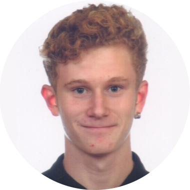

# Carlos Vicente Mellinas
## Programador Backend

### Datos Personales:
-  **Dirección**:  Avda. Camilo José Cela nº4 7A, 03600, Elda
- **Número de teléfono**: 644321513
 - **Correo electrónico**: carlosvicentemellinas.cvm@gmail.com
- **Fecha de nacimiento**: 13-10-2001
- **Lugar de Nacimiento**: Elda (Alicante)
- **Nacionalidad**:  Española
### Experiencia Laboral:
***CABLEWORLD. Departamento técnico de empresas.*** 
*MARZO DE 2019 - JUNIO DE 2019*

Durante el periodo de prácticas laborales estuve desarrollando
las funciones pertinentes a un técnico perteneciente al
departamento técnico enfocado a empresas.
Las funciones eran atender y solucionar los problemas técnicos
de los clientes, vía telefónica o presencial.

### Formacion:
***Educación Secundario Obligatoria**, IES La Melva
2013 - 2017*

***Carnet de Manipulador de Alimentos**, Serlicoop
12/04/2017*

***Alérgenos en Hostelería**, Serlicoop
12/04/2017*

***Técnico Medio de Sistemas Microinformáticos y Redes**, IES Poeta Paco Mollá
2017-2019*

***Técnico Superior en Desarrollo de Aplicaciones Web**, IES Poeta Paco Mollá
2019-Actualmente*

### Idiomas y otros conocimientos:
- ***Inglés***. Nivel A2
-  Conocimientos en programación ***Python***
-  Conocimientos en programación ***Java***
-  Conocimientos en programación ***JavaScript***
-  Conocimientos en programación ***PHP***

### Aptitudes:
- Carné de conducir A1
- Carné de conducir B
- Posibilidad de incorporación inmediata
- Horario flexible
- Adaptable, colaborador, trabajador y entusiasta

### Otros logros
- 4ª Posición Cyberolympics 2018
- 3ª Posición Cyberolympics 2019
- Miembro de la selección española de ciberseguridad 2020

[Github](https://github.com/CarlosVicenteMellinas/markdown)
[Docker Hub](https://hub.docker.com/u/carlosvicente01)

